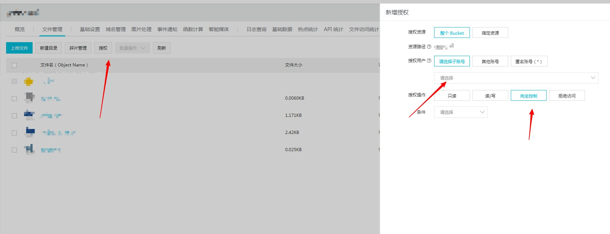

## 前言
之前本来是用微博图床的，但是上个月微博图床取消了外链，所以想想还是自己也搭个图床算了，自己搭建图床的话，要求如下：
- 访问速度要快
- 稳定，不要经常出问题，也不要因为网站搬家而移半天
- 安全，不容易因为程序漏洞导致站点被黑而图片全部遗失

综上，我打算将图片前端上传至`OSS`上，不使用后端，方便快速安全的进行部署

---

## 使用
我们需要先新建配置一个 `oss` 的 `bucket` 来存储我们的图片

### 新建bucket
在 [oss控制台](https://oss.console.aliyun.com/) 新建一个 `bucket`，读写权限设置为公有读

### Bucket设置 
从浏览器中直接访问 `OSS` 需要开通 `Bucket` 的 `CORS` 设置：
- 将 `allowed origins` 设置成 `*`
- 将 `allowed methods` 设置成 `PUT, GET, POST, DELETE, HEAD`
- 将 `allowed headers` 设置成 `*`
- 将 `expose headers` 设置成 `etag x-oss-request-id`

### 访问控制
主账户的权限太大了，所以我们最好在 [RAM访问控制](https://ram.console.aliyun.com/) 专门新建一个用户来管理新建的这个 `bucket`

新建一个用户

填入用户名称，勾选编程访问

新建成功，`AccesskeyID` 和 `Accesskey Secret` 需要保存好

回到 `bucket`，添加授权给刚才新建的用户

### 图床配置

各个配置项说明如下：
- [accessKeyId]：刚才新建用户的 `accessKeyId`
- [accessKeySecret]：刚才新建用户的 `accessKeySecret`
- [bucket]：新建用来存储图片的 `oss` `bucket` 名
- [region]：新建 `bucket` 时所选的所在的区域，比如

这个 `bucket` 的 `region` 就是 `oss-cn-beijing`

配置完成

---

## 演示

